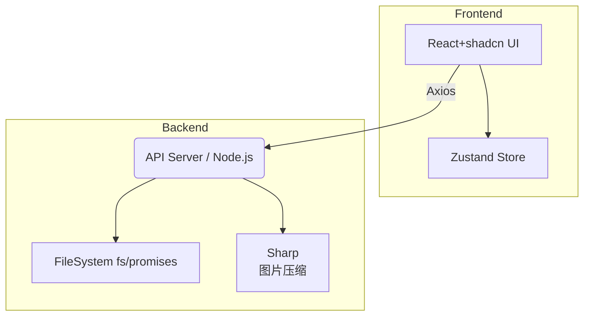

轻量级图片标注 Web 应用设计文档  
（基于 React + shadcn ui，运行于本地 localhost）

一、总体目标  
1. 提供极简安装与运行体验，前后端同仓库、同端口启动。  
2. 支持在 `dataset/raw-data/<folder>` 中任选文件夹，对其全部图片完成：「预处理 + 字段集标注 + 框选标注」，并把结果写入 `dataset/labeled-data/<同名 folder>`。  
3. 所有功能仅面向单机用户，无需鉴权。  
4. 技术栈：Vite + React 18 + TypeScript + shadcn ui + Zustand（状态管理）+ **Node.js 18+（已在 v23 环境验证）** + Sharp（图片压缩）。  
5. 遵循用户自定义规则：  
   • 所有 JSON 结构用 `.ts` 类型定义文件描述  
   • UI 避免紫色系背景  
   • 依赖统一用 **npm / pnpm** 管理（若需 Python 辅助脚本再使用 uv，与主流程解耦）  

二、功能拆分与流程  

1. 选择数据集文件夹  
   • 前端调用 `GET /api/folders` → 后端扫描 `dataset/raw-data` 下一级目录并返回列表  
   • 选中后将其写入全局状态 `currentFolder`  

2. 创建 / 读取字段集  
   • 若 `dataset/raw-data/<folder>/fields.json` 不存在：  
      弹出对话框，允许用户录入「字段名、类型、可选值(可选)」等信息  
      （同时选择是否在输出图片上绘制标注框 `drawBoxesOnImage: true/false`）  
   • 字段集保存格式示例：  
```json
{
  "createdAt": "2024-03-07T12:00:00Z",
  "drawBoxesOnImage": false,  // 是否在保存的图片上绘制标注框
  "fields": [
    { "key": "jobType", "label": "作业类型", "type": "select", "options": ["焊接","打磨"] },
    { "key": "isRed",   "label": "是否为红色", "type": "boolean" },
    { "key": "action",  "label": "行为描述", "type": "text" }
  ]
}
```  
   • 保存到 `fields.json`；同时复制一份到 `dataset/labeled-data/<folder>/fields.json` 作为冗余

3. 预处理与文件写入
   • 在用户选择文件夹后、开始标注前，后台对 `dataset/raw-data/<folder>` 中所有图片进行预处理，生成统一 JPG 格式、符合大小/分辨率要求的新图片，保存至 `dataset/labeled-data/<folder>/images`。前端将加载这些预处理后的图片进行标注。
   • 预处理流程：
     1) 若原图体积 > 2 MB 或最大边 > 1920 px，使用 Sharp 等比压缩并转为 jpg；否则仅转换为 jpg（保持原尺寸）。
     2) 保证处理后的文件名与原文件一致 (扩展名统一为 `.jpg`)。
     3) 使用 `p-limit` 限制并行处理数量为 4，并将处理进度写入 `preprocess.log` 供前端轮询展示。

4. 图片浏览与标注
   • 前端分页或虚拟滚动浏览 `images` 文件夹下的所有图片。
   • 选中图片后进入标注工作区：
     - 左侧为标注画布 (基于 Konva 或 fabric.js)，支持绘制/编辑矩形框。
     - 右侧根据 `fields.json` 动态渲染字段表单。
   • 标注数据保存在一个文件中：`dataset/labeled-data/<folder>/labels.json`。该文件是一个对象，key 为图片名，value 为标注信息：
```ts
export interface BoundingBox { // 坐标均为相对值 0~1
  id: string;
  x: number;      // 相对左上角 X
  y: number;      // 相对左上角 Y
  w: number;      // 宽度占比
  h: number;      // 高度占比
  label?: string;
}

export interface FieldValues { [fieldKey: string]: string | number | boolean; }

export interface ImageLabel {
  imageName: string;
  boxes?: BoundingBox[];
  fields: FieldValues;
}

// labels.json 结构:
export type LabelsFile = Record<string, ImageLabel>;
```
   • 保存操作：用户每次点击保存，前端 `POST /api/label/:folder/:imageName`，请求体为 `ImageLabel`。后端读取 `labels.json`，更新或插入对应图片名的条目后写回文件。
   • 若 `fields.json` 中 `drawBoxesOnImage` 为 `true`，则在保存标注的同时，后端调用 Sharp 将标注框绘制在 `images` 文件夹对应的图片上。

5. 批量完成 / 导出
   • 页面顶部显示进度条：已标注 / 总数
   • 提供「导出 ZIP」按钮：后端打包 `dataset/labeled-data/<folder>` 并下载

三、系统架构  



后端 API 设计  
| 方法 | 路径 | 请求体 | 响应 | 说明 |  
| --- | --- | --- | --- | --- |  
| GET | /api/folders | - | `string[]` | 列出 raw-data 子目录 |  
| GET | /api/fields/:folder | - | `FieldSet` | 取字段集 |  
| POST | /api/fields/:folder | `FieldSet` | 200 | 保存/更新字段集 |  
| GET | /api/images/:folder | - | `string[]` | 该目录下图片名 |  
| GET | /api/label/:folder/:img | - | `ImageLabel` | 取单张图片标注（无则空） |  
| POST | /api/label/:folder/:img | `ImageLabel` | 200 | 保存标注并执行预处理 |  
| GET | /api/export/:folder | - | binary | 下载 zip |
*注：上表为前端调用路径，Vite 代理会将 `/api` 前缀移除后转发至后端。*

四、核心前端组件  

1. FolderSelector  
2. FieldSetEditor (Dialog)  
3. ImageGrid / VirtualizedList  
4. AnnotationCanvas (封装 fabric.js & 事件)  
5. FieldForm (根据字段动态渲染)  
6. TopBar（进度 & 导出）  

五、状态管理（Zustand）  
```ts
interface AppState {
  currentFolder?: string;
  fields?: FieldSet;
  images: string[];
  labels: Record<string, ImageLabel>;
  // actions...
}
```  

六、目录结构 (简化)  

```
llm-arena/
├─ dataset/
│  ├─ raw-data/
│  │  └─ <folder>/...
│  └─ labeled-data/
│     └─ <folder>/...
├─ src/
│  ├─ backend/
│  │  ├─ index.ts          // express 入口
│  │  └─ services/...
│  └─ frontend/
│     ├─ components/...
│     ├─ pages/...
│     ├─ hooks/...
│     └─ types/...
└─ scripts/python/（可选，若引入 Python 工具则在此使用 uv）
```

七、预处理细节  
• 判断逻辑：  
```ts
const needResize = (meta: { size: number; width: number; height: number; }) =>
  meta.size > 2*1024*1024 || Math.max(meta.width, meta.height) > 1920;
```  
• 自适应压缩策略：先按 quality=90 试压缩，若仍超 2 MB，则每次降低 5 直至 75；一旦满足条件即停止，以尽量保留画质。
  伪代码：
```ts
let quality = 90;
let buffer: Buffer;
do {
  buffer = await sharp(src)
    .resize({ width: 1920, height: 1920, fit: "inside" })
    .jpeg({ quality })
    .toBuffer();
  quality -= 5;
} while (buffer.length > 2*1024*1024 && quality >= 75);
await fs.promises.writeFile(dst, buffer);
```
• 若原图尺寸/大小本就符合要求，则仅执行 `.jpeg({ quality: 95 })` 转格式，不缩放。
• 目录/文件写入统一 `fs.mkdir(target,{recursive:true})`，确保幂等。

八、异常与健壮性  
1. 后端所有 I/O 使用 try/catch；向前端返回统一错误 JSON。  
2. 前端对每张图片保存失败时给出红色 toast，不中断后续标注。  
3. 关闭浏览器前检测未保存修改，提示确认。

九、性能与 UX  
• 图片列表使用虚拟滚动避免一次性加载过多缩略图。  
• Canvas 内部对象统一使用 id 字段，便于后续增删改。  
• 不使用紫色背景色；主色调选用 `sky-600` / `emerald-500` 等。  
• 响应式布局：≥1280px 双栏；≤768px 变为上下两栏。  
• 应用端口由环境变量 `PORT` (前端，默认 5173) 和 `BACKEND_PORT` (后端，默认 5174) 分别控制，开发时通过 Vite 代理实现同源访问。

十、开发与运行指令  
```bash
# 安装依赖
npm install

# 本地开发（热重载）：并行启动 Vite 前端 + tsx 后端
npm run dev

# 生产构建
npm run build         # 前端打包 + 后端 tsc 编译
npm start            # node dist/backend/index.js
```

十一、迭代计划  
1️⃣ 基础文件夹选择 & 字段集 CRUD  
2️⃣ 图片列表浏览 + 单张字段填报  
3️⃣ 集成框选组件 + 保存 JSON  
4️⃣ 后端压缩逻辑 & 进度统计  
5️⃣ ZIP 导出、UI 优化、美化细节  
6️⃣ 测试集标注完整流程并收尾

package.json 脚本示例：
```jsonc
{
  "scripts": {
    "dev": "concurrently \"vite\" \"npm run dev:backend\"",
    "dev:backend": "tsx watch src/backend/index.ts",
    "build": "vite build && tsc -p tsconfig.backend.json",
    "start": "node dist/backend/index.js",
    "lint": "eslint --ext .ts,.tsx src"
  }
}
```